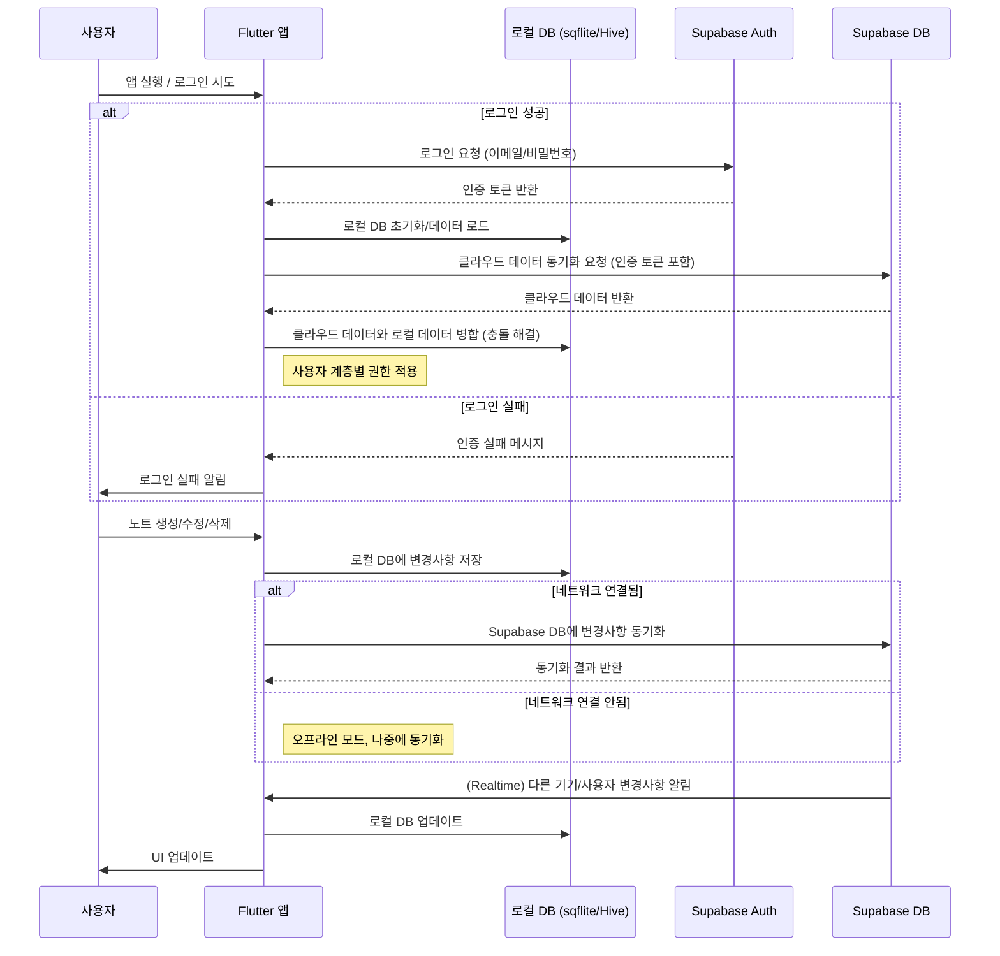
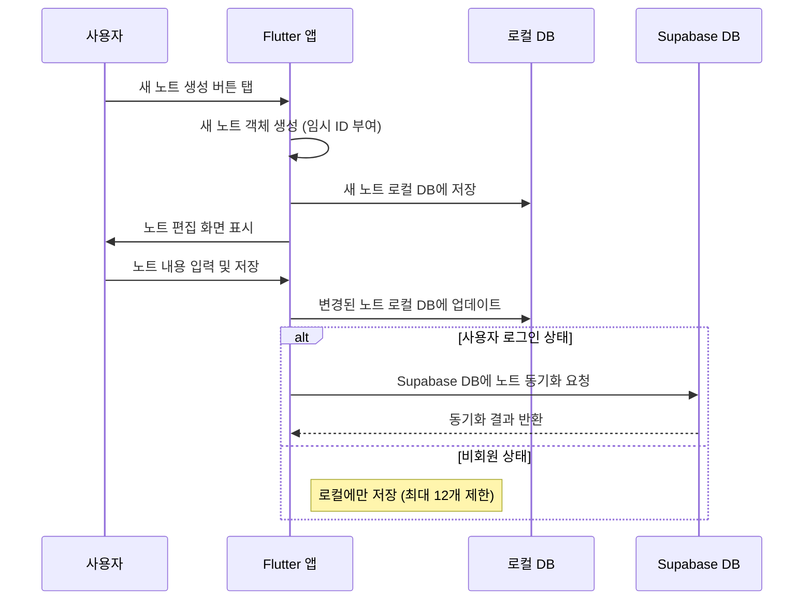
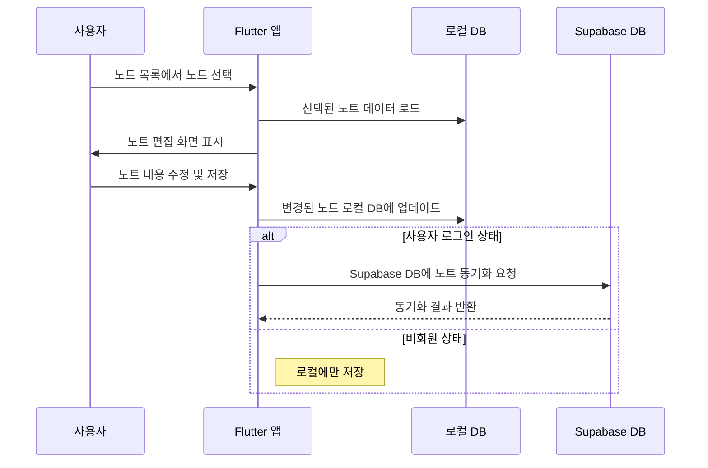
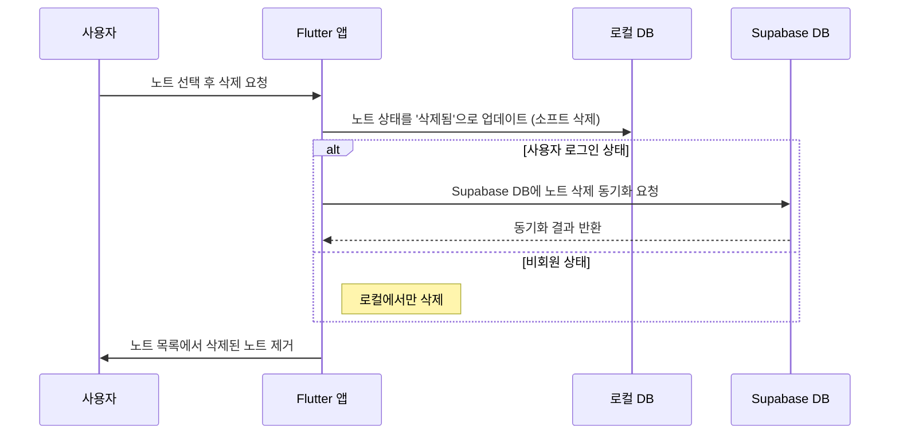

# 모바일 필기 앱 - 주요 흐름 설명도

이 문서는 모바일 필기 앱의 핵심 기능에 대한 데이터 및 사용자 흐름을 시각적으로 설명합니다.

## 1. 사용자 인증 및 데이터 동기화 흐름

이 흐름은 사용자가 앱에 로그인하고 로컬 데이터와 클라우드 데이터가 어떻게 동기화되는지를 보여줍니다.

**흐름 설명:**

1.  **앱 실행 및 로그인:** 사용자가 앱을 실행하고 로그인(또는 회원가입)을 시도합니다. Flutter 앱은 Supabase Auth 서비스에 인증 요청을 보냅니다.
2.  **인증 및 토큰 획득:** Supabase Auth는 사용자 정보를 확인하고 성공 시 인증 토큰을 Flutter 앱에 반환합니다.
3.  **로컬 DB 초기화/로드:** Flutter 앱은 로컬 데이터베이스(sqflite/Hive)를 초기화하거나 기존 데이터를 로드합니다.
4.  **클라우드 데이터 동기화:** Flutter 앱은 획득한 인증 토큰을 사용하여 Supabase DB에 클라우드 데이터 동기화를 요청합니다. Supabase DB는 사용자에게 허용된 데이터를 반환합니다.
5.  **데이터 병합 및 충돌 해결:** Flutter 앱은 클라우드에서 가져온 데이터와 로컬 데이터를 병합합니다. 이 과정에서 충돌 해결 전략(예: Last Writer Wins)이 적용됩니다.
6.  **노트 변경 및 로컬 저장:** 사용자가 앱 내에서 노트를 생성, 수정, 삭제하면, 변경 사항은 즉시 로컬 데이터베이스에 저장됩니다.
7.  **클라우드 동기화 (온라인 시):** 네트워크 연결이 되어 있으면, Flutter 앱은 로컬 DB의 변경 사항을 Supabase DB에 자동으로 동기화합니다.
8.  **오프라인 모드:** 네트워크 연결이 없으면, 변경 사항은 로컬 DB에만 저장되고, 연결이 복구되면 자동으로 동기화가 진행됩니다.
9.  **실시간 동기화 (프리미엄/협업):** Supabase Realtime 기능을 통해 다른 기기나 협업 사용자의 변경 사항이 실시간으로 Flutter 앱에 전달되고, 로컬 DB 및 UI가 업데이트됩니다.

## 2. 노트 관리 흐름

### 2.1. 노트 생성 흐름

**흐름 설명:**
1.  **새 노트 생성:** 사용자가 앱에서 새 노트 생성 버튼을 탭합니다.
2.  **노트 객체 생성:** Flutter 앱은 임시 ID를 가진 새 노트 객체를 생성하고 로컬 DB에 저장합니다.
3.  **편집 및 저장:** 사용자가 노트 내용을 입력하고 저장하면, 변경 사항이 로컬 DB에 업데이트됩니다.
4.  **클라우드 동기화 (회원):** 로그인한 사용자의 경우, 노트가 Supabase DB에 동기화됩니다.
5.  **로컬 저장 (비회원):** 비회원의 경우, 노트는 로컬에만 저장되며 최대 12개로 제한됩니다.

### 2.2. 노트 수정 흐름

**흐름 설명:**
1.  **노트 선택:** 사용자가 노트 목록에서 수정할 노트를 선택합니다.
2.  **노트 로드:** Flutter 앱은 로컬 DB에서 해당 노트 데이터를 로드하여 편집 화면에 표시합니다.
3.  **수정 및 저장:** 사용자가 노트 내용을 수정하고 저장하면, 변경 사항이 로컬 DB에 업데이트됩니다.
4.  **클라우드 동기화 (회원):** 로그인한 사용자의 경우, 수정된 노트가 Supabase DB에 동기화됩니다.

### 2.3. 노트 삭제 흐름

**흐름 설명:**
1.  **노트 삭제 요청:** 사용자가 노트를 선택하고 삭제를 요청합니다.
2.  **소프트 삭제:** Flutter 앱은 로컬 DB에서 노트의 상태를 '삭제됨'으로 업데이트(소프트 삭제)합니다.
3.  **클라우드 동기화 (회원):** 로그인한 사용자의 경우, 삭제 상태가 Supabase DB에 동기화됩니다.
4.  **로컬 삭제 (비회원):** 비회원의 경우, 노트는 로컬에서만 삭제됩니다.
5.  **UI 업데이트:** 앱 화면에서 삭제된 노트가 제거됩니다.