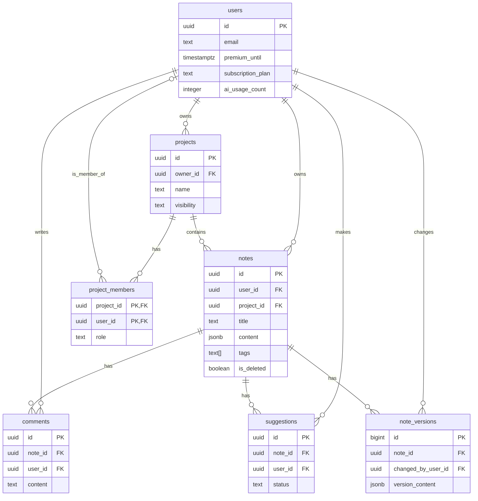

# 모바일 필기 앱 - 데이터베이스 설계서

이 문서는 '모바일 필기 앱'의 데이터베이스 구조, 테이블 명세, 관계, 제약 조건 및 정책을 상세히 정의합니다.

## 1. 개요

본 설계서는 Supabase의 PostgreSQL을 기반으로 하며, 사용자 데이터, 노트, 프로젝트, 협업 관련 데이터를 관리하는 것을 목표로 합니다. 모든 테이블과 컬럼명은 소문자와 스네이크 케이스(snake_case)를 사용합니다.

## 2. ERD (Entity-Relationship Diagram)

테이블 간의 관계를 시각적으로 표현한 다이어그램입니다.

## 3. 테이블 명세 (Table Specifications)

### 3.1. `users`
사용자 계정 정보를 저장합니다. Supabase의 `auth.users` 테이블과 연동되며, 공개적으로 접근 가능한 프로필 정보를 담습니다.

| 컬럼명 | 데이터 타입 | 제약 조건 | 설명 |
| :--- | :--- | :--- | :--- |
| `id` | `uuid` | `PK`, `FK to auth.users.id` | 사용자 고유 ID (Auth 서비스와 연결) |
| `email` | `text` | `UNIQUE` | 사용자 이메일 (읽기 전용) |
| `created_at` | `timestamptz` | `NOT NULL`, `default now()` | 계정 생성 시각 |
| `premium_until` | `timestamptz` | | 프리미엄 구독 만료일 (NULL이면 무료) |
| `subscription_plan` | `text` | | 구독 플랜 종류 (예: 'monthly', 'yearly') |
| `ai_usage_count` | `integer` | `NOT NULL`, `default 0` | 무료 회원의 AI 기능 일일 사용 횟수 |

### 3.2. `notes`
개별 노트의 내용을 저장하는 핵심 테이블입니다.

| 컬럼명 | 데이터 타입 | 제약 조건 | 설명 |
| :--- | :--- | :--- | :--- |
| `id` | `uuid` | `PK`, `default gen_random_uuid()` | 노트의 고유 ID |
| `user_id` | `uuid` | `FK to users.id`, `NOT NULL` | 노트 소유자의 ID |
| `project_id` | `uuid` | `FK to projects.id` | 소속된 프로젝트의 ID (개인 노트는 NULL) |
| `title` | `text` | `NOT NULL` | 노트 제목 |
| `content` | `jsonb` | | 블록 기반의 노트 본문 (확장성 고려) |
| `tags` | `text[]` | | AI 분류 등을 통해 생성된 태그 목록 |
| `created_at` | `timestamptz` | `NOT NULL`, `default now()` | 생성 시각 |
| `updated_at` | `timestamptz` | `NOT NULL`, `default now()` | 최종 수정 시각 |
| `is_deleted` | `boolean` | `NOT NULL`, `default false` | 소프트 삭제 여부 |

### 3.3. `projects`
노트를 그룹화하는 프로젝트 정보를 저장합니다.

| 컬럼명 | 데이터 타입 | 제약 조건 | 설명 |
| :--- | :--- | :--- | :--- |
| `id` | `uuid` | `PK`, `default gen_random_uuid()` | 프로젝트의 고유 ID |
| `owner_id` | `uuid` | `FK to users.id`, `NOT NULL` | 프로젝트를 생성한 소유자의 ID |
| `name` | `text` | `NOT NULL` | 프로젝트 이름 |
| `description` | `text` | | 프로젝트에 대한 간략한 설명 |
| `visibility` | `text` | `NOT NULL`, `default 'private'` | 공개 범위 ('private', 'public') |
| `created_at` | `timestamptz` | `NOT NULL`, `default now()` | 생성 시각 |
| `updated_at` | `timestamptz` | `NOT NULL`, `default now()` | 최종 수정 시각 |

### 3.4. `project_members`
프로젝트와 사용자 간의 다대다 관계를 정의하여 협업 기능을 지원합니다.

| 컬럼명 | 데이터 타입 | 제약 조건 | 설명 |
| :--- | :--- | :--- | :--- |
| `project_id` | `uuid` | `PK`, `FK to projects.id` | 참여하는 프로젝트의 ID |
| `user_id` | `uuid` | `PK`, `FK to users.id` | 참여하는 사용자의 ID |
| `role` | `text` | `NOT NULL`, `default 'viewer'` | 멤버 역할 ('viewer', 'editor', 'admin') |
| `joined_at` | `timestamptz` | `NOT NULL`, `default now()` | 프로젝트 참여 시각 |

### 3.5. `comments`
노트에 달린 댓글 정보를 저장합니다.

| 컬럼명 | 데이터 타입 | 제약 조건 | 설명 |
| :--- | :--- | :--- | :--- |
| `id` | `uuid` | `PK`, `default gen_random_uuid()` | 댓글의 고유 ID |
| `note_id` | `uuid` | `FK to notes.id`, `NOT NULL` | 댓글이 달린 노트의 ID |
| `user_id` | `uuid` | `FK to users.id`, `NOT NULL` | 댓글 작성자의 ID |
| `content` | `text` | `NOT NULL` | 댓글 내용 |
| `created_at` | `timestamptz` | `NOT NULL`, `default now()` | 작성 시각 |

### 3.6. `note_versions`
노트의 변경 이력을 저장하여 버전 관리를 지원합니다. (프리미엄 기능)

| 컬럼명 | 데이터 타입 | 제약 조건 | 설명 |
| :--- | :--- | :--- | :--- |
| `id` | `bigserial` | `PK` | 버전의 순차적 ID |
| `note_id` | `uuid` | `FK to notes.id`, `NOT NULL` | 원본 노트의 ID |
| `changed_by_user_id` | `uuid` | `FK to users.id` | 해당 버전을 만든 사용자 ID |
| `version_content` | `jsonb` | | 해당 버전의 노트 전체 내용 스냅샷 |
| `created_at` | `timestamptz` | `NOT NULL`, `default now()` | 버전 생성 시각 |

## 4. 인덱스 전략 (초안)

- **자동 생성:** 모든 기본 키(PK)와 외래 키(FK)에는 자동으로 인덱스가 생성됩니다.
- **수동 추가 (권장):**
    - `notes` 테이블: `user_id` 및 `project_id` 컬럼에 대한 인덱스를 생성하여 특정 사용자의 노트나 특정 프로젝트의 노트를 빠르게 조회할 수 있도록 합니다.
    - `notes` 테이블: `tags` 컬럼에 `GIN` 인덱스를 사용하여 태그 기반 검색 성능을 향상시킵니다.
    - `project_members` 테이블: `user_id` 컬럼에 대한 인덱스를 생성하여 특정 사용자가 참여한 모든 프로젝트를 빠르게 찾을 수 있도록 합니다.

## 5. RLS (Row Level Security) 정책 (초안)

데이터 보안을 위해 모든 테이블에 RLS를 활성화하고, 다음 정책을 기본으로 합니다.

- **`notes` 테이블:**
    - **SELECT/UPDATE/DELETE:** 노트의 `user_id`가 현재 로그인한 사용자의 ID(`auth.uid()`)와 일치하는 경우에만 허용합니다. 또는, 사용자가 해당 노트가 속한 프로젝트의 멤버인 경우 `SELECT`를 허용합니다.
    - **INSERT:** 로그인한 사용자는 `user_id`를 자신의 ID로 하여 노트를 생성할 수 있습니다.
- **`projects` 테이블:**
    - **SELECT:** 프로젝트의 `owner_id`가 `auth.uid()`와 일치하거나, `project_members` 테이블에 해당 사용자가 멤버로 등록된 경우에만 허용합니다.
    - **UPDATE/DELETE:** 프로젝트의 `owner_id`가 `auth.uid()`와 일치하거나, `project_members` 테이블에서 `admin` 역할을 가진 경우에만 허용합니다.
- **`project_members` 테이블:**
    - **SELECT:** 자신이 속한 프로젝트의 멤버 목록만 조회할 수 있습니다.
    - **INSERT/DELETE:** 해당 프로젝트의 `admin` 역할을 가진 사용자만 멤버를 초대하거나 삭제할 수 있습니다.
