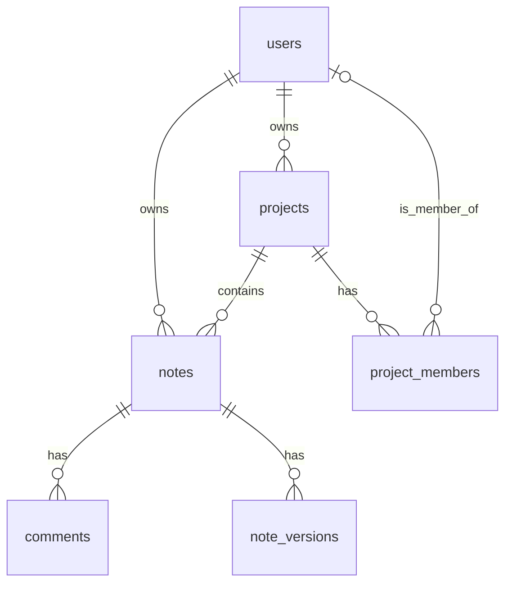

# 모바일 필기 앱 - 통합 기술 설계서 (Final)

이 문서는 '모바일 필기 앱' 개발에 필요한 모든 기술적 사항을 종합적으로 정의하는 마스터 설계 문서입니다.

## 1. 시스템 아키텍처

모바일 필기 앱은 Flutter 프레임워크를 사용하여 개발되며, Supabase를 백엔드 서비스로 활용하고 외부 LLM API를 통해 AI 기능을 통합합니다. 앱은 **오프라인 우선(Offline-First)** 아키텍처를 채택하여 네트워크 환경에 관계없이 안정적인 사용자 경험을 제공합니다.

### 1.1. 아키텍처 다이어그램
```mermaid
graph TD
    A[모바일 필기 앱 (Flutter)] -- "API 요청/응답" --> B(Supabase Client SDK);
    A -- "로컬 데이터 CRUD" --> H[Local Database (sqflite/Hive)];
    B -- "DB 쿼리, 인증, 실시간 메시지" --> C[Supabase Backend];
    C --> D[PostgreSQL Database];
    C --> E[Supabase Auth];
    C --> F[Supabase Realtime];
    C --> G[Supabase Edge Functions];
    G -- "외부 API 호출 (보안)" --> I[외부 LLM API (OpenAI/Gemini)];
    I --> J[AI Service];
```

### 1.2. 주요 구성 요소
*   **모바일 필기 앱 (Flutter):** 사용자 인터페이스, 비즈니스 로직, 로컬 데이터 관리를 담당합니다.
*   **Local Database (sqflite/Hive):** 오프라인 지원을 위한 기기 내 데이터베이스. 앱의 상태는 항상 로컬 DB를 기준으로 즉시 반영됩니다.
*   **Supabase Backend:** PaaS 형태의 백엔드 서비스.
    *   **PostgreSQL Database:** 모든 데이터의 최종 저장소(Source of Truth)입니다.
    *   **Supabase Auth:** 사용자 인증 및 세션 관리를 담당합니다.
    *   **Supabase Realtime:** 실시간 협업 기능을 위해 사용됩니다.
    *   **Supabase Edge Functions:** 외부 API 호출, 결제 검증 등 안전한 서버 측 로직을 실행합니다.

### 1.3. 오프라인 우선 전략 (Offline-First Strategy)
*   **UI와 로컬 DB:** 앱의 UI는 항상 로컬 데이터베이스를 기준으로 렌더링되어, 네트워크와 무관하게 빠른 반응성을 보장합니다.
*   **동기화 큐:** 오프라인에서 발생한 모든 변경사항(C/U/D)은 로컬 DB 내의 별도 '동기화 큐'에 기록됩니다.
*   **재연결 시 동기화:** 네트워크 연결이 복구되면, 백그라운드 서비스가 큐에 쌓인 작업을 순차적으로 Supabase 서버에 전송하여 데이터 정합성을 맞춥니다.
*   **충돌 해결:** 기본 전략은 '마지막 쓰기'가 이기는(Last Write Wins) 방식입니다.

## 2. 데이터베이스 설계

### 2.1. ERD (Entity-Relationship Diagram)


### 2.2. 테이블 명세
(`DATABASE_DESIGN.md`의 상세 명세와 동일)

*   **`users`**: 사용자 프로필 정보
*   **`notes`**: 노트 콘텐츠 및 메타데이터
*   **`projects`**: 프로젝트 정보
*   **`project_members`**: 프로젝트 멤버 및 역할
*   **`comments`**: 노트 댓글
*   **`note_versions`**: 노트 변경 이력 (버전 관리)
*   **`suggestions`**: (향후 확장 기능) 내용 제안

## 3. 인증 및 권한 관리

### 3.1. 인증 흐름
1.  사용자가 이메일 또는 소셜 로그인을 시도합니다.
2.  Flutter 앱은 Supabase Auth에 인증을 요청합니다.
3.  인증 성공 시, Supabase Auth는 JWT(Access Token, Refresh Token)를 발급합니다.
4.  Flutter 앱은 토큰을 기기 내 안전한 저장소(FlutterSecureStorage)에 보관하고, 이후 모든 API 요청 헤더에 Access Token을 포함하여 전송합니다.
5.  Access Token 만료 시, Refresh Token을 사용하여 자동으로 새로운 토큰을 발급받습니다.

### 3.2. RLS (Row Level Security) 정책
모든 테이블에 RLS를 활성화하여 데이터 접근을 통제합니다.
*   **`notes` 접근:** 노트 소유자(`user_id`)이거나, 해당 노트가 속한 프로젝트의 멤버인 경우에만 `SELECT`가 가능합니다. `INSERT`, `UPDATE`, `DELETE`는 소유자만 가능합니다.
*   **`projects` 접근:** 프로젝트 소유자(`owner_id`)이거나, `project_members`에 포함된 경우에만 `SELECT`가 가능합니다. 수정/삭제는 `admin` 역할만 가능합니다.

## 4. API 및 클라이언트 모듈 설계

### 4.1. 클라이언트 모듈 구조 (Clean Architecture 기반)
*   **Presentation Layer (UI):** Flutter 위젯. 사용자 입력 및 상태 변화 표시.
*   **Domain Layer (Business Logic):** Use-cases 및 비즈니스 로직. UI와 데이터를 분리.
*   **Data Layer (Data Handling):**
    *   **Repository:** 데이터 소스를 추상화하는 저장소 패턴을 구현합니다. (예: `NoteRepository`)
    *   **DataSource:** 로컬 DB(sqflite)와 원격 API(Supabase) 두 종류의 데이터 소스를 가집니다.
    *   **SyncService:** 백그라운드에서 동기화 큐를 처리하는 서비스.

### 4.2. 백엔드 API (Supabase)
*   **주요 API:** Supabase가 제공하는 PostgREST API를 기본으로 사용합니다. 모든 API 요청은 RLS 정책에 의해 자동으로 필터링됩니다.
*   **서버리스 함수 (Edge Functions):** 특정 로직 수행을 위해 다음 함수들을 구현합니다.
    *   `onUserCreate`: 신규 가입 시 `auth.users` 테이블의 정보를 `public.users` 테이블로 복사하는 트리거 함수.
    *   `validateReceipt`: 인앱 결제 영수증을 검증하고 사용자 등급을 업데이트하는 HTTP 엔드포인트.
    *   `aiProxy`: 외부 LLM API를 안전하게 호출하는 프록시 엔드포인트.

## 5. 결제 시스템 연동

1.  **사용자:** 앱 내에서 프리미엄 구독을 요청합니다.
2.  **클라이언트:** Flutter의 `in_app_purchase` 라이브러리를 통해 플랫폼(Apple/Google) 결제를 호출합니다.
3.  **플랫폼:** 결제 성공 후 영수증(receipt) 데이터를 클라이언트에 반환합니다.
4.  **클라이언트:** 받은 영수증을 Supabase의 `validateReceipt` Edge Function으로 전송합니다.
5.  **서버 (Edge Function):** 해당 플랫폼의 API 서버와 통신하여 영수증의 유효성을 검증합니다.
6.  **서버:** 검증 성공 시, `users` 테이블의 `premium_until` 필드를 업데이트하여 구독 상태를 활성화합니다.

## 6. AI 기능 통합

*   **보안 호출:** 클라이언트는 AI 기능을 직접 호출하지 않습니다. 대신 `aiProxy` Edge Function에 요청을 보냅니다.
*   **프록시 역할:** `aiProxy` 함수는 요청한 사용자의 등급(무료/프리미엄)과 사용량을 확인하고, 이에 맞는 프롬프트를 구성하여 서버에 저장된 API 키로 외부 LLM을 호출합니다. 이를 통해 API 키 노출을 방지하고 사용량을 제어합니다.