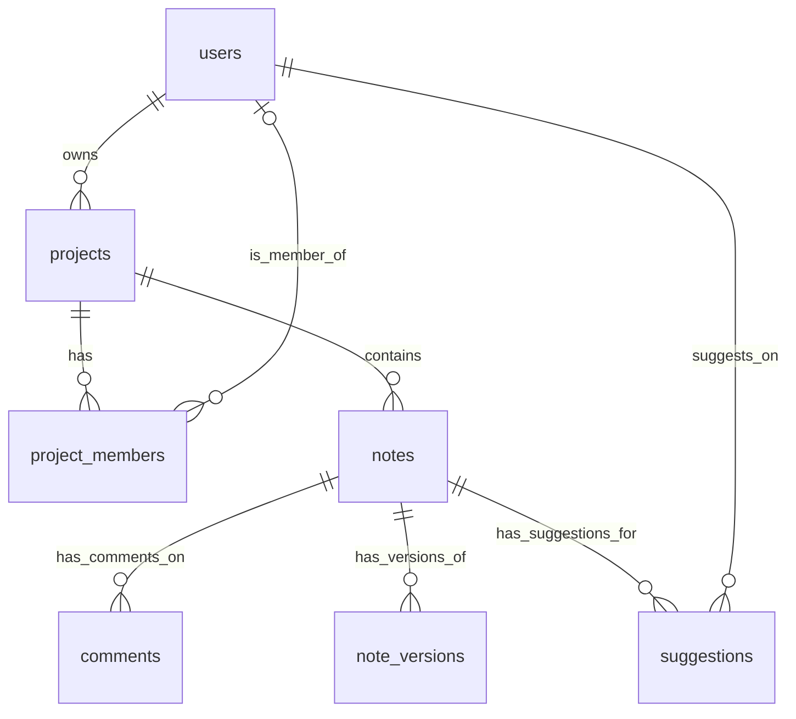

# 기술 설계서 v3 (협업 중심)

## 1. 시스템 아키텍처

모바일 필기 앱은 Flutter 프레임워크, Supabase 백엔드, 그리고 **실시간 협업**을 핵심으로 구성됩니다. 아키텍처는 '오프라인 우선' 전략을 채택하여 네트워크 연결이 불안정한 환경에서도 안정적인 사용성을 제공합니다.

### 1.1. 아키텍처 다이어그램
```mermaid
graph TD
    A[모바일 앱 (Flutter)] -- "API 요청/응답" --> B(Supabase Client SDK);
    A -- "로컬 데이터 CRUD" --> H[로컬 DB (WatermelonDB/Hive)];
    B -- "DB 쿼리, 인증, 실시간 메시지" --> C[Supabase 백엔드];
    C --> D[PostgreSQL 데이터베이스];
    C --> E[Supabase Auth];
    C --> F[Supabase Realtime];
    C --> G[Supabase Edge Functions];

    subgraph "협업 데이터 흐름"
        A -- "편집 내용 전송" --> F;
        F -- "변경사항 브로드캐스트" --> A;
    end
```

### 1.2. 주요 구성 요소
- **모바일 앱 (Flutter)**: UI, 비즈니스 로직, 로컬 데이터 관리 및 **실시간 협업 세션 처리**를 담당합니다.
- **로컬 DB (WatermelonDB/Hive)**: 오프라인 지원을 위한 기기 내 데이터베이스. 모든 UI는 로컬 DB를 기준으로 즉시 렌더링됩니다.
- **Supabase 백엔드**:
    - **PostgreSQL**: 데이터의 최종 저장소(Source of Truth).
    - **Supabase Auth**: 사용자 인증 및 세션 관리.
    - **Supabase Realtime**: **실시간 협업의 핵심.** 변경 사항을 모든 연결된 클라이언트에게 브로드캐스트합니다.
    - **Supabase Edge Functions**: `onUserCreate`, `validateReceipt` 등 핵심 비즈니스 로직만 처리. (AI 관련 프록시 함수는 제외)

## 2. 협업 아키텍처 상세 설계

### 2.1. 실시간 데이터 동기화 모델
- **Supabase Realtime 활용**: `notes` 테이블의 변경 사항(`UPDATE`)을 실시간으로 구독합니다. 사용자가 노트를 편집하면, 변경된 내용은 즉시 Supabase로 전송되고, Realtime 서비스를 통해 해당 노트를 구독 중인 모든 클라이언트에게 브로드캐스트됩니다.
- **데이터 구조**: 노트의 `content` 필드는 일반 텍스트 또는 마크다운 형식으로 저장합니다. CRDT와 같은 복잡한 구조는 초기 MVP에서는 도입하지 않고, 텍스트 기반 동기화에 집중합니다.

### 2.2. 편집 충돌 해결 전략
- **기본 전략: 마지막 쓰기 우선 (Last Write Wins, LWW)**
    - 여러 사용자가 동시에 같은 부분을 수정할 경우, 가장 마지막에 서버에 도달한 내용이 최종적으로 저장됩니다.
    - **구현**: `notes` 테이블의 `updated_at` 타임스탬프를 기준으로 충돌을 판단합니다. 클라이언트는 자신이 받은 마지막 `updated_at` 이후의 변경 사항만 수락합니다.
- **프로(Pro) 기능: 변경 내용 추적 (Track Changes)**
    - 사용자의 편집 내용은 즉시 적용되지 않고, '제안'(Suggestion) 형태로 별도 테이블(`suggestions`)에 저장됩니다.
    - 제안 내용은 원본 노트에 하이라이트 처리되어 표시되며, 프로젝트 관리자(또는 편집 권한이 있는 사용자)가 이를 수락하거나 거절할 수 있습니다.
    - **테이블**: `suggestions` (`id`, `note_id`, `user_id`, `content_diff`, `status`)

### 2.3. 오프라인 협업 시나리오
1.  사용자 A가 오프라인 상태에서 노트 X를 수정합니다.
2.  변경 내용은 로컬 DB의 '동기화 큐'에 저장됩니다.
3.  그 사이, 온라인 상태인 사용자 B가 동일한 노트 X를 수정하고, 이 내용은 서버에 즉시 반영됩니다.
4.  사용자 A가 다시 온라인 상태가 되면, 앱은 먼저 서버로부터 최신 버전의 노트 X를 가져옵니다.
5.  앱은 로컬 변경 사항과 서버의 최신 버전을 비교합니다. **기본적으로 서버의 내용이 우선**되며, 사용자 A의 변경 내용은 충돌로 간주됩니다.
6.  **충돌 알림**: 사용자에게 "다른 사용자에 의해 노트가 변경되었습니다. 변경 사항을 어떻게 처리할까요?" 라는 팝업을 띄웁니다.
7.  **선택지 제공**: [내 변경사항 덮어쓰기], [서버 변경사항 유지], [변경사항 복사하여 새 노트 만들기] 등의 선택지를 제공하여 사용자가 직접 충돌을 해결하도록 유도합니다.

## 3. 데이터베이스 설계 (협업 중심)

### 3.1. ERD (Entity-Relationship Diagram)


### 3.2. 변경/추가된 테이블 명세
- **`project_members`**: `role` 필드 추가 (`admin`, `editor`, `commenter`, `viewer`).
- **`note_versions`**: 노트의 전체 변경 이력을 저장. 프로 플랜의 핵심 기능.
- **`suggestions`**: 프로 플랜의 '변경 내용 추적' 기능을 위한 테이블. `content_diff` 필드는 변경된 내용의 diff 정보를 저장.

## 4. 인증 및 권한 관리 (RLS)

- **`notes` 테이블 RLS 정책 강화**:
    - `SELECT`: `project_members` 테이블에 `viewer` 이상의 역할로 포함된 사용자는 접근 가능.
    - `UPDATE`: `project_members` 테이블에 `editor` 이상의 역할로 포함된 사용자는 수정 가능.
    - `DELETE`: `project_members` 테이블에 `admin` 역할로 포함된 사용자만 삭제 가능.
- **`suggestions` 테이블 RLS 정책**:
    - `INSERT`: `editor` 이상의 역할만 제안 생성 가능.
    - `UPDATE` (status 변경): `admin` 역할만 제안을 수락/거절 가능.

## 5. API 및 클라이언트 모듈 설계

### 5.1. 클라이언트 모듈 구조 (Clean Architecture)
- **Presentation Layer**: 협업 상태(접속자 목록, 커서 위치 등)를 표시하는 UI 컴포넌트 추가.
- **Domain Layer**: 실시간 메시지 파싱 및 상태 업데이트 로직.
- **Data Layer**:
    - **`CollaborationRepository`**: Supabase Realtime 채널을 구독하고, 실시간 이벤트를 처리하는 로직을 담당.
    - **`SyncService`**: 오프라인 변경사항과 서버의 최신 상태 간의 충돌을 감지하고 해결 전략을 호출하는 로직 강화.

### 5.2. 백엔드 API (Supabase)
- **AI 관련 Edge Function 제거**: `aiProxy` 함수를 제거하여 백엔드 복잡성을 줄이고 협업 기능에 집중합니다.
- **`validateReceipt` Edge Function**: 유료 플랜 결제 검증을 위해 유지됩니다.
