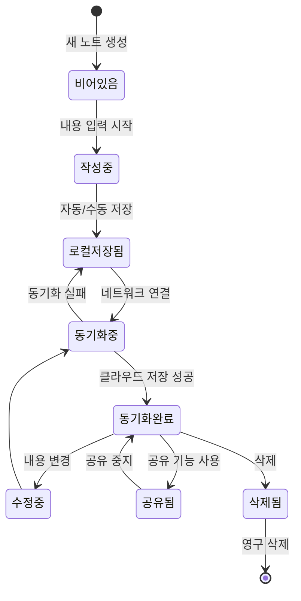

# 모바일 필기 앱 - UI/UX 디자인 명세서 v3 (협업 중심)

이 문서는 '모바일 필기 앱'의 전체 UI/UX 설계를 상세히 정의합니다. 특히 **실시간 협업 기능**에 초점을 맞춰 사용자 경험을 최적화합니다.

## 1. 디자인 원칙

*   **단순함 (Simplicity):** 사용자가 필기 및 협업이라는 핵심 기능에 집중할 수 있도록 불필요한 요소를 최소화하고, 명확하고 간결한 인터페이스를 제공합니다.
*   **직관성 (Intuitiveness):** 별도의 학습 없이도 누구나 쉽게 앱의 기능을 이해하고 사용할 수 있도록 설계합니다. 일반적인 모바일 앱 디자인 패턴을 따릅니다.
*   **효율성 (Efficiency):** 사용자가 원하는 작업을 최소한의 단계로 완료할 수 있도록 사용자 흐름을 최적화합니다. (예: 빠른 노트 생성, 쉬운 검색, 원활한 협업)
*   **일관성 (Consistency):** 앱 전체에 걸쳐 일관된 디자인 언어(색상, 아이콘, 컴포넌트)를 사용하여 통일된 사용자 경험을 제공합니다.
*   **확장성 (Scalability):** 향후 추가될 기능(예: AI 기능 팩)을 자연스럽게 통합할 수 있는 유연한 레이아웃 구조를 가집니다.

## 2. 시각적 디자인 가이드

### 2.1. 색상 팔레트

모던하고 눈이 편안한 색상 조합을 사용합니다. 라이트 모드와 다크 모드를 모두 지원합니다.

*   **라이트 모드:**
    *   **Primary:** `#4A90E2` (차분한 파란색) - 주요 버튼, 활성화된 아이콘, 링크 등
    *   **Secondary / Accent:** `#50E3C2` (밝은 청록색) - 새 노트 생성(FAB), 프리미엄 기능 강조 등
    *   **Background:** `#FFFFFF` (흰색)
    *   **Surface:** `#F7F9FA` (옅은 회색) - 카드, 입력 필드 배경 등
    *   **Text (Primary):** `#333333` (진한 회색)
    *   **Text (Secondary):** `#888888` (회색)
*   **다크 모드:**
    *   **Primary:** `#58A6FF` (밝은 파란색)
    *   **Secondary / Accent:** `#50E3C2` (밝은 청록색)
    *   **Background:** `#121212` (검정색에 가까운 어두운 회색)
    *   **Surface:** `#1E1E1E` (어두운 회색)
    *   **Text (Primary):** `#E0E0E0` (밝은 회색)
    *   **Text (Secondary):** `#A0A0A0` (중간 회색)

### 2.2. 타이포그래피

가독성이 높은 산세리프 폰트를 사용합니다. (예: Pretendard, Noto Sans KR)

*   **Headline 1 (앱 제목, 큰 타이틀):** 24px, Bold
*   **Headline 2 (화면 제목):** 20px, Bold
*   **Subtitle (노트 제목):** 18px, Medium
*   **Body 1 (본문):** 16px, Regular
*   **Body 2 (부가 정보, 캡션):** 14px, Regular
*   **Button:** 16px, Medium

### 2.3. 아이코그래피

*   **아이콘 셋:** Material Design Icons를 사용하여 일관성과 명확성을 확보합니다.
*   **스타일:** 간결하고 이해하기 쉬운 `Outlined` 스타일을 기본으로 사용하며, 활성화 상태에서는 `Filled` 스타일을 사용할 수 있습니다.

## 3. 네비게이션 패턴 및 정보 구조 (Navigation & IA)

### 3.1. 주 네비게이션 패턴 (Main Navigation Pattern)
*   **하단 탭 바 (Bottom Tab Bar):** 앱의 핵심 기능으로의 빠른 접근을 위해 하단 탭 바 방식을 채택합니다.
*   **탭 구성 (4개):**
    1.  **노트:** 모든 노트를 보거나 필터링하는 기본 화면.
    2.  **프로젝트:** 프로젝트 목록 및 관리를 위한 화면.
    3.  **검색:** 전체 노트 및 내용을 검색하는 화면.
    4.  **설정:** 계정, 구독, 앱 설정을 관리하는 화면.

### 3.2. 정보 구조 시각화 (IA Visualization)
```mermaid
graph TD
    A[시작 Splash] --> B{로그인 상태?};
    B -- 자동 로그인 --> C[메인 앱];
    B -- 비로그인 --> D[로그인/회원가입] --> C;

    subgraph 메인 앱 (하단 탭 네비게이션)
        C --> E[노트 탭];
        C --> F[프로젝트 탭];
        C --> G[검색 탭];
        C --> H[설정 탭];
    end

    subgraph 노트 플로우
        E -- 노트 클릭 --> I[노트 편집];
        E -- 새 노트(+) --> I;
        I -- 더보기 --> J[버전 기록 ★];
        I -- 댓글 아이콘 --> K[댓글 Bottom Sheet];
    end

    subgraph 프로젝트 플로우
        F --> L[프로젝트 목록];
        L -- 프로젝트 클릭 --> M[프로젝트 상세];
        M -- 멤버 관리 --> N[멤버 관리 화면];
        M -- 노트 목록 --> E;
    end

    subgraph 설정 플로우
        H --> O[설정 목록];
        O -- 구독 관리 --> P[프리미엄 구독 안내];
        O -- 계정 관리 --> Q[계정 삭제 확인 팝업];
    end
```

## 4. 상세 사용자 시나리오 (Detailed User Scenarios)

### 4.1. 시나리오 1: 신규 사용자 가입 및 첫 노트 작성
1.  **시작:** 사용자가 앱을 처음 실행하면 스플래시 화면 후 로그인/회원가입 화면으로 이동한다.
2.  **가입:** 사용자는 이메일로 간편하게 회원가입을 완료한다.
3.  **온보딩:** 로그인 후, 메인 화면(노트 탭)에 도착하면 노트가 비어있다는 안내와 함께 첫 노트 작성을 유도하는 UI가 표시된다.
4.  **첫 노트 작성:** 사용자가 `[+]` 버튼을 눌러 노트 편집 화면으로 이동하고, 제목과 내용을 입력한다.
5.  **자동 저장:** 사용자가 뒤로가기 버튼을 누르자, 별도의 저장 동작 없이 노트가 자동으로 저장되고 목록에 나타나는 것을 확인하며 만족감을 느낀다.

### 4.2. 시나리오 2: 협업 프로젝트 초대 및 댓글/변경 제안 피드백 (Pro 기능)
1.  **프로젝트 생성:** 기획자 A는 새로운 '앱 기획안' 프로젝트를 생성하고, 동료 디자이너 B를 이메일로 초대한다.
2.  **초대 수락:** 디자이너 B는 이메일 알림을 받고 프로젝트에 참여한다.
3.  **공동 작업:** 기획자 A가 프로젝트 내 'UI/UX 설계' 노트를 수정하면, 디자이너 B의 화면에도 변경사항이 실시간으로 반영된다.
4.  **댓글 피드백:** 디자이너 B는 특정 디자인 요소에 대해 의견을 남기기 위해 노트 하단의 댓글 기능을 이용해 "이 부분 로고를 좀 더 키우는게 어떨까요?"라고 댓글을 작성한다.
5.  **변경 제안 (Track Changes):** 디자이너 B는 직접 노트 내용을 수정하는 대신, '변경 제안' 모드를 활성화하여 특정 텍스트를 삭제하고 새로운 텍스트를 추가하는 제안을 남긴다. (예: 삭제된 텍스트는 빨간색 취소선, 추가된 텍스트는 초록색 밑줄로 표시)
6.  **피드백 확인 및 반영:** 기획자 A는 댓글 및 변경 제안 알림을 받고 내용을 확인한 후, 댓글에 답글을 남기고 변경 제안을 검토한다. 마음에 드는 변경 제안은 '수락'하고, 그렇지 않은 것은 '거절'한다. 모든 변경 제안을 처리한 후 "좋은 의견 감사합니다! 반영했습니다."라고 답글을 남긴다.

### 4.3. 시나리오 3: Pro 구독 및 고급 기능 사용
1.  **기능 접근:** 무료 사용자가 노트 편집 화면의 '더보기' 메뉴에서 '버전 기록'(Pro 기능)을 탭한다.
2.  **구독 유도:** 앱은 'Pro 구독 안내' 화면을 표시하여 기능의 이점을 설명하고 구독을 유도한다.
3.  **결제 진행:** 사용자가 '연간 구독' 플랜을 선택하고 '구독하고 시작하기' 버튼을 누른다. OS(App Store/Play Store)에서 제공하는 표준 결제창이 나타난다.
4.  **결제 완료:** 사용자가 결제를 성공적으로 완료하면, 앱은 "구독이 완료되었습니다!"라는 확인 메시지를 표시한다.
5.  **기능 사용:** 사용자는 자동으로 '버전 기록' 화면으로 이동하여, 이전에 접근할 수 없었던 고급 기능을 즉시 사용할 수 있게 된다.

## 5. 접근성 (Accessibility - A11y)

모든 사용자가 앱을 원활하게 사용할 수 있도록 다음 접근성 지침 준수를 목표로 합니다.

*   **텍스트 명도 대비:** WCAG 2.1 AA 레벨에 따라, 일반 텍스트는 4.5:1, 큰 텍스트는 3:1 이상의 명도 대비를 유지합니다.
*   **터치 영역 크기:** 모든 버튼, 아이콘, 링크 등 상호작용 요소는 최소 44x44px의 터치 영역을 확보하여 정확한 터치를 돕습니다.
*   **대체 텍스트:** 모든 이미지와 아이콘 버튼에는 스크린 리더 사용자를 위한 적절한 설명(대체 텍스트)을 제공합니다.
*   **동적 타입 지원:** 사용자가 기기 설정에서 변경한 폰트 크기에 맞춰 앱 내의 텍스트 크기도 유동적으로 조절되도록 지원합니다.

## 6. 주요 화면 와이어프레임

### 6.1. 메인 화면 (노트 목록)
*   **빈 화면 상태:** '첫 노트를 작성해보세요!'라는 안내 문구와 함께 `[+]` 버튼을 강조하는 가이드 UI를 표시합니다.
*   **오류 상태:** '노트를 불러올 수 없습니다. 아래로 당겨 새로고침하세요.'라는 메시지와 함께 재시도 버튼을 표시합니다.

### 6.2. 노트 편집 화면
```
+---------------------------------+
| [<] [저장✓] [프로젝트:A v] [공유] [...] |
+---------------------------------+
| [      제목을 입력하세요      ]   |
|---------------------------------|
| 다른 사용자 커서 [👤] (2명 접속중) |
| 노트 내용을 입력하는 에디터...    |
|                                 |
|  (텍스트 선택 시 컨텍스트 메뉴)   |
|  [복사|붙여넣기|변경 제안(★)]    |
|                                 |
+---------------------------------+
| [B][I][U]...[댓글(3)][변경 제안(1)] |
+---------------------------------+
```
*   **추가/수정된 컴포넌트:**
    *   **프로젝트 지정 UI:** 상단에 `[프로젝트:A v]` 와 같이 현재 소속된 프로젝트를 표시하고, 탭하면 프로젝트 목록을 보여주는 모달이 나타나 소속을 변경할 수 있습니다.
    *   **실시간 협업자 표시:** 다른 사용자가 동시 편집 중일 때, 해당 위치에 커서와 함께 프로필 아이콘 `[👤]`을 표시하고, 접속 중인 총 인원수를 표시합니다. (예: `(2명 접속중)`) 
    *   **텍스트 선택 컨텍스트 메뉴:** 텍스트를 길게 눌러 선택하면, OS 기본 메뉴 외에 '변경 제안(★)' 옵션을 제공하는 메뉴가 나타납니다. (AI 사전 제거)
    *   **댓글 UI:** 하단 툴바의 `[댓글(3)]` 버튼을 탭하면, 해당 노트에 달린 댓글 목록을 보여주는 Bottom Sheet가 화면 하단에서 올라옵니다.
    *   **변경 제안 UI:** 하단 툴바에 `[변경 제안(1)]` 버튼을 추가하여 현재 노트에 적용되지 않은 변경 제안의 개수를 표시하고, 탭하면 변경 제안 목록을 보여주는 Bottom Sheet가 나타납니다.

### 6.3. 프로젝트 생성/수정 화면
```
+---------------------------------+
| [< 뒤로]      [프로젝트 생성]     [저장] |
+---------------------------------+
|                                 |
|  이름                           |
|   [    프로젝트 이름을 입력...   ]   |
|                                 |
|  설명 (선택)                    |
|   [    프로젝트에 대한 설명...   ]   |
|                                 |
|  공개 범위                      |
|   (•) Private  ( ) Public      |
|                                 |
+---------------------------------+
```

### 6.4. 버전 기록 화면 (★ Pro)
```
+---------------------------------+
| [< 뒤로]      [버전 기록]         |
+---------------------------------+
|                                 |
| +-----------------------------+ |
| | v3. 2분 전 (홍길동)         | |
| | [미리보기] [이 버전으로 복원] | |
| +-----------------------------+ |
|                                 |
| +-----------------------------+ |
| | v2. 1시간 전 (김철수)       | |
| | [미리보기] [이 버전으로 복원] | |
| +-----------------------------+ |
+---------------------------------+
```

### 6.5. Pro 구독 안내 화면
```
+---------------------------------+
|                             [X] |
+---------------------------------+
|      ✨ Pro로 업그레이드      |
|                                 |
|  [✓] 클라우드 저장공간 무제한   |
|  [✓] 실시간 공동 편집 (무제한)  |
|  [✓] 편집 권한 관리             |
|  [✓] 변경 내용 추적             |
|  [✓] 전체 버전 기록             |
|                                 |
|  [  월간 구독: ₩5,000/월  ]     |
|  [  연간 구독: ₩50,000/년 ](15% 할인) |
|                                 |
|        [ 구독하고 시작하기 ]        |
+---------------------------------+
```

## 7. 팝업 / 모달 와이어프레임

### 7.1. 삭제 확인 팝업
```
+---------------------------------+
|                                 |
|   [!] 노트를 삭제하시겠습니까?  |
|   이 작업은 되돌릴 수 없습니다.   |
|                                 |
|   [ ] 완전히 삭제 (DB에서 제거)   |
|                                 |
|   [   취소   ]  [   삭제   ]    |
+---------------------------------+
```

### 7.2. 멤버 초대 팝업
```
+---------------------------------+
|        멤버 초대하기            |
|---------------------------------|
|  이메일                         |
|   [ user@example.com      ]   |
|                                 |
|  역할                           |
|   [ Viewer                v ]   |
|                                 |
|       [ 초대 보내기 ]           |
+---------------------------------+
```

## 8. 인터랙션 및 모션 가이드

### 8.1. 모션 원칙
*   **피드백과 방향성:** 모든 인터랙션은 사용자의 행동에 대한 명확한 시각적 피드백을 제공해야 한다. 화면 전환은 사용자가 앱의 구조 내에서 어디로 이동하는지 쉽게 인지할 수 있도록 방향성을 가져야 한다.
*   **속도와 자연스러움:** 애니메이션은 사용자의 작업을 방해하지 않도록 빠르고(150~300ms) 자연스러워야 한다. 물리 법칙을 모방한 가속/감속 곡선을 사용한다.

### 8.2. 주요 인터랙션 예시
*   **Bottom Sheet:** 화면 하단에서 위로 부드럽게 슬라이드되어 나타나며, 배경은 어두워져(Dimmed) 현재 컨텍스트에 집중시킨다.
*   **FAB (Floating Action Button):** 탭하면 확장되거나, 관련된 작은 버튼들이 부채꼴 형태로 펼쳐지는(Speed Dial) 애니메이션을 사용한다.
*   **모달/팝업 (Modal/Pop-up):** 화면 중앙에 부드럽게 확대되며(Fade-in & Scale-up) 나타난다.

## 9. 주요 객체 상태 다이어그램

### 9.1. '노트' 객체 상태 다이어그램 (Note Object State Diagram)

노트가 생성된 후 삭제될 때까지 가질 수 있는 주요 상태의 흐름을 보여준다.


